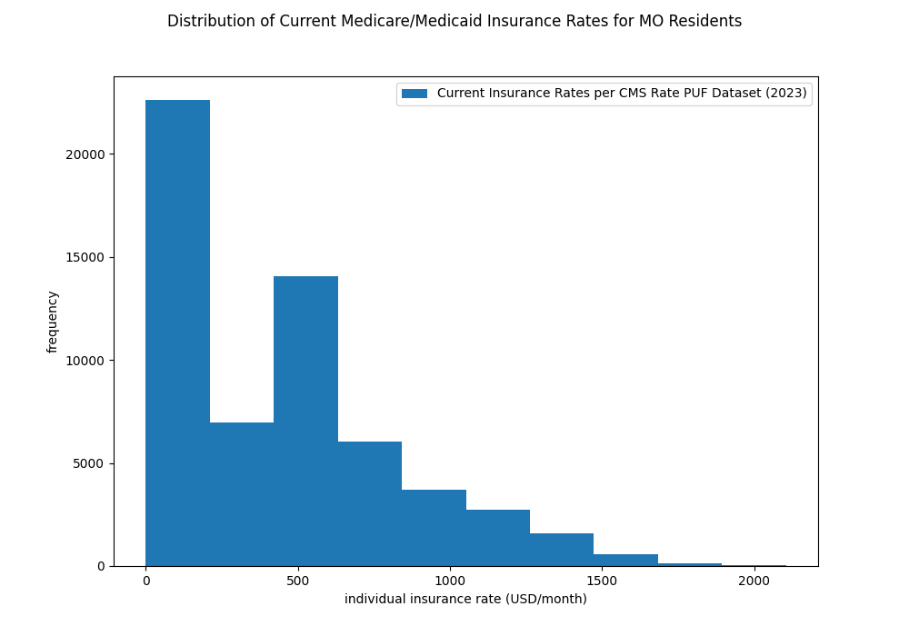
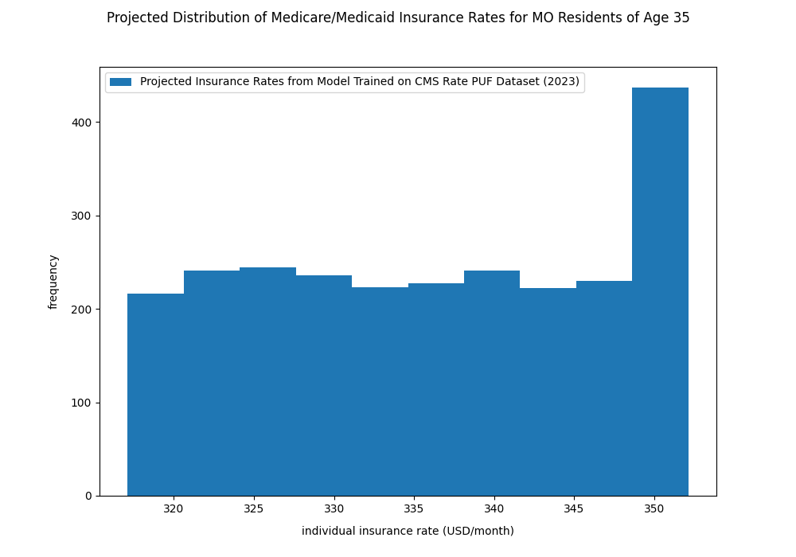

# ITP 216 Final Project Guide
## Hirad Hosseini, Fall 2023

To set up the project, please run these commands:
```python 
python csv_to_db.py #creates insurance.db and transfers data from Rate_PUF.csv
```

```python 
python app.py #starts Flask app
```

For a sample query, input the following data:
1. Select state "MO" from dropdown. Your output should match:


2. Input age of 35. Your output should match:
